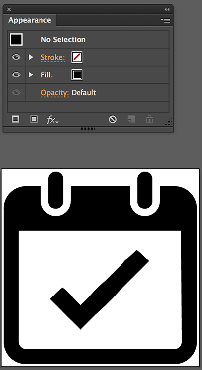
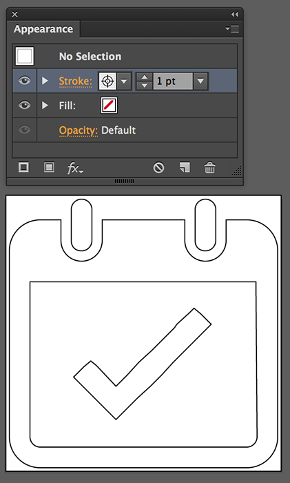
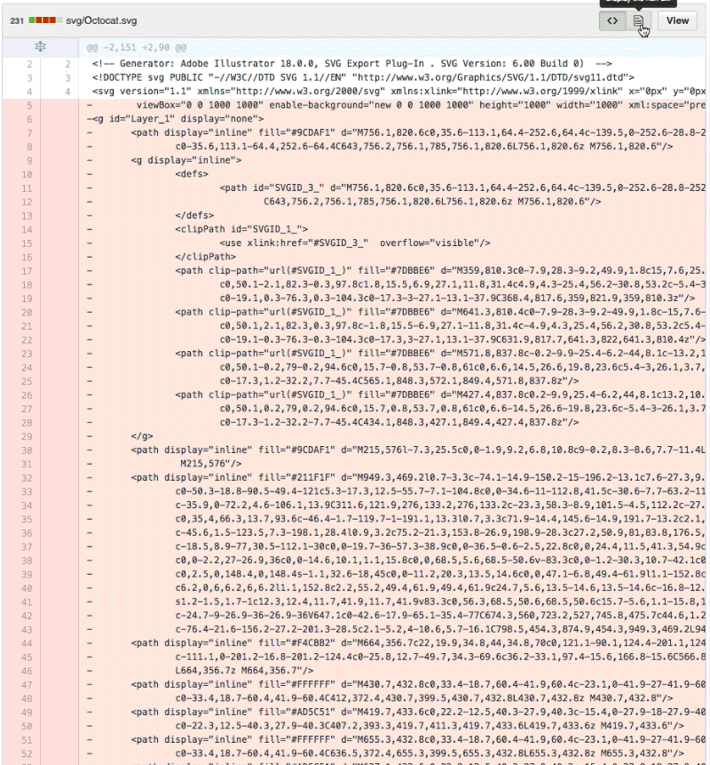
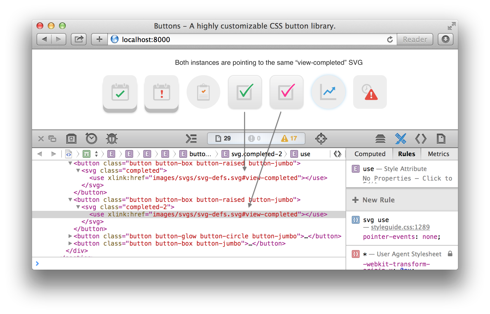

<em class="explanation">The following is a guest post by Rob Levin. Rob is a Senior UI/UX Developer at <a href="https://www.mavenlink.com/careers">Mavenlink</a>, and coauthor of the most popular <a href="https://github.com/unicorn-ui/Buttons/">CSS Button Library</a> on the web. In this article, Rob solves some of the problems you'll likely face when incorporating inline SVGs in to a production application for the first time.</em> 

#5 Gotchas Your Gonna Face Getting Inline SVG Into Production

You've read up on how inline SVG's are better than font icons and are ready to take the plunge. You call a meeting with your team to discuss moving over to inline SVG icons. Your boss is skeptical. He looks you in the eyes and says &ldquo;So, can you guarantee this isn't going to come back and bite us in the butt?&rdquo;. You hesitate a bit, but somehow conjure up the confidence to confirm, "Yes, this is definitely the direction we need to go!"

This was me just a couple months ago, and here are some &ldquo;gotchas&rdquo; I ran in to with corresponding workarounds. I'll start by examining the workarounds one by one, and then provide a working example at the end.

*Please note that this is not a persuasive article on why you should use inline SVG. For that, you should read this [popular css-tricks article](http://css-tricks.com/icon-fonts-vs-svg/) that points out the advantages of inline svg over icon fonts.*

## Gotcha One: Missing the Target

In order to achieve caching using an external SVG file (you seriously don't want to dump `~1.5kb * 50` icons on your page in a non-cacheable way right?!), you need to include the [svg4everybody](https://github.com/jonathantneal/svg4everybody) library on your page. Essentially, this shiv will use UA sniffing to detect if you're running a [&ldquo;problemattic version&rdquo;](https://github.com/jonathantneal/svg4everybody/blob/master/svg4everybody.js#L83) of IE or Android that doesn't properly cache external definitions files, and, if so, removes all `svg use` elements, and replaces them with embedded elements containing the corresponding SVG definition data pulled in via ajax. At the end of the day, we just care about the fact that our original SVG that might have looked like:

```html
<svg>
	<use xlink:href="/path/to/svgdef.svg#your-icon" … ></use>
</svg>
```

Will get replaced with an *embedded element* that looks something like this:

```html
<svg viewBox="0 0 16 16"><path> … </path></svg>
```

### CSS: Hitting the Target

Depending on the source SVG, you might end up with a hierarchy looking like: `svg path` (as above), or, it might be `svg g`, or possibly a combination of grouped and path descendants–but do remember, you'll need your CSS to target the &ldquo;pollyfilled&rdquo; cases–this means you're CSS rules should absolutely never target the `svg > use` element directly…it will get completely removed in IE!

### JavaScript: Hitting the Target

The same idea holds true for any JavaScript manipulations on the SVG clone itself. For example, we may want to [swap icons](http://css-tricks.com/swapping-svg-icons/) on a hover and–one technique we may choose–is to alter the `xlink:href` attribute with JavaScript when such an event fires. Since, in this article, we've elected to use an external file with the above described shim, we can't reliably use that technique (again, the `use` element gets replaced in IE). My recommendation is to just hide/show via CSS classes (Technique #1 described in [Swapping Out SVG Icons](http://css-tricks.com/swapping-svg-icons/) article), and be sure to target the SVG clone itself.

*If we're directly dropping in the inline SVG definition at the top of our page (ex. right after the opening `<body>` tag), we won't have this concern and using the technique of manipulating the `xlink:href` attribute is fine.*

### Selector Examples

Just to make the above points crystal clear, here's a CSS selector that would work in browsers that fully support external SVG definitions but fails when [svg4everybody](https://github.com/jonathantneal/svg4everybody) pollyfills IE:

```css
.my-svg use {
	fill: red;
}
```
It turns out there's no real need or gain to target `use`, so just change that to the following to work for all cases:

```css
.my-svg {
	fill: red;
}
```
While we're talking about selectors, we should take this opportunity to point out you won't be able to &ldquo;reach in&rdquo; to original SVG definition with something like:

```css
svg.parent path.child { /* won't work! */ }
```

The same would apply to trying to style anything in the def itself via the cloned instance be it a shape, path, group, etc. It may be obvious, but this is only an issue, here, because we're using the `use xlink:href` strategy.

## Gotcha Two: Working With A Designer

If your icons generally use only one color, applying CSS styling to a cloned instance in &ldquo;one sweep&rdquo; is trivial with: `fill: <your-color>`. For such cases, the designer on the project will need to be mindful to create the vector art applying either: only black fills with transparent strokes, or, only path data (transparent fills and strokes). You'll still be able to apply strokes via CSS if you need to.

To understand why this is, we first need to understand how our vector application exports SVG.

*I use Adobe Illustrator, but if you're using another vector program like [Inkscape](https://inkscape.org/en/) or [Sketch](http://bohemiancoding.com/sketch/), etc., you'll want to refer to that software's documentation to see if their behavior matches what follows. Worse case, you can just export the files in the various ways I describe in the following and test out what your application's generated SVG looks like.*

### Illustrator SVG Export Behavior

At time of writing, the latest version of Illustrator CC exports to SVG as follows:

* If you don't define a fill or stroke, or, you define only a fill, but that fill is *black* (completely black as in `#000`), the exported SVG paths and shapes will *not* contain a fill or stroke attribute:

```html
<path …positional information… >
<rect …positional information… >
```

* If you define a non-black fill, or, if you define a stroke (of any color including *black*), the exported SVG's corresponding paths and shapes *will* contain stroke and/or fill attributes like:

```html
<path stroke="#000000" … >
<rect fill="fabdad" … >
```

These presentational attributes will always be overridable by CSS should you apply a style to the SVG symbol, path, shape, etc., **directly**. The caveats involved with applying CSS to a *cloned instance* (not directly), are described next.

### Exporting Black Fill On / Stroke Transparent

If you're source SVG was exported with black fills only (no strokes), or paths only, then you have a lot of flexibility, since you'll be able to apply a stroke or fill via the CSS. 



In this first example (note I'm using Sass syntax), we apply a CSS fill and stroke to the cloned instance:

```css
.filled-instance {
  stroke: #cc8ac1;
  stroke-width: 5px;
  fill: lighten(#cc8ac1, 20%);
}
```

You'll also be able to achieve an outlined affect by simply turning off the fill and applying a stroke via CSS:

```css
.filled-instance-off {
  stroke: #d08aaf;
  stroke-width: 5px;
  fill: transparent;
}
```
The reason that this works so beautifully, is that our SVG definition doesn't have any fill or stroke attributes defined, and thus our CSS gets applied and all is well.

### Exporting Stroke On / Fill Transparent



So the bad news here, is that you cannot apply a style to the stroke on the cloned instance (remember, our cloned instance, in this example, in turn, points to an SVG def that we created with "stroke only"). We can't apply a fill to our cloned instance either, since our SVG definition now has `fill="none"` and that will take precedence):

```css
.stroked-instance {
  stroke: green;//nothing happens
  fill: red;//nothing happens
}
```

### Some Workarounds

You probably should just avoid this situation altogether by exporting black fills with transparent strokes, or just paths, but, if you, for some reason, do still need to have your styles take affect, you'll instead have to style the SVG symbol *directly* with something like:

```css
symbol#completed-copy-stroked [stroke] {
  stroke: #dd6435;
  stroke-width: 5px;
}
```
*Note that the `symbol` part of the selector above is unnecessary but used here for clarity as to what element we're targetting*

Again, this isn't really ideal if you're using an inline SVG with cloned instances approach, since we'd prefer to apply styles to our clone instances where possible. 

Another technique you can always use, is to just add classes within the source SVG and apply CSS to those directly. These styles will be *global* which may or may not be a problem–you'll have to decide that for your case. This technique works regardless of how you exported the SVG. Because you're hand adding a CSS class, it's there for you to hook into (albeit directly–we're targetting the SVG definition's sub-element directly and not styling through a cloned instance):

```css
.ibestrokin {
  stroke: magenta;
  stroke-width: 5px;
}
.istrokeittotheeast {
  stroke: green;
  stroke-width: 7px;
}
```
Maybe I'm showing my age, but I just can't help but think of [Clarence Carter](http://en.wikipedia.org/wiki/Clarence_Carter) with all this talk of [&ldquo;strokin&rdquo;](https://www.youtube.com/watch?v=P7gMkiOPSeA).

To my mind, only being able to style the SVG directly (and not the cloned instance), is less than ideal. Therefore, my recommendation would be to avoid exporting strokes altogether in cases where you're going to be using inline SVG and cloned instances. If you already have artwork that has strokes defined, you can look in to ways to convert those to paths via something like *Outline Stroke* before you export.

<p data-height="268" data-theme-id="0" data-slug-hash="raBZvv" data-default-tab="result" data-user="roblevin" class='codepen'>See the Pen <a href='http://codepen.io/roblevin/pen/raBZvv/'>Inline SVG Fill and Stroke </a> by Rob Levin (<a href='http://codepen.io/roblevin'>@roblevin</a>) on <a href='http://codepen.io'>CodePen</a>.</p>
<script async src="//assets.codepen.io/assets/embed/ei.js"></script>


### Post Processing

Another consideration, is If you're using a post-processing library such as [grunt-svgstore](https://github.com/FWeinb/grunt-svgstore) to cleanup fills and strokes. In this case, the generated SVG may not have explicit fill or stroke attributes at all, and only path information will be left in the resultant definition file. For this case, you definitely want to convert any strokes to paths or risk losing the corresponding visible lines altogether. Alternatively, don't ask for strokes to be removed by the post-processor (but face some of the issues I discussed earlier). Bottom line, if you're artwork really must have a stroke, figure you'll have to target the SVG directly.

### Conclusions

So I guess takeaway is that you'll need to make a decision with the designer, as to whether you want all fills and strokes to be completely controlled via CSS–in which case you should just use paths with transparent fills and strokes (or black fills if you'd like them kept around for reference)–or, does it make more sense to start with sensible defaults, and then use CSS to override these as needed. If you're using inline SVG and prefer to style to cloned instances (not directly to the SVG), my recommendation is to just use paths.

## Gotcha Three: Achieving Color Variation

One of the purported benefits of using SVG, in general, is the flexible style control we get since we can apply CSS to an SVG's *path*, *shape*, etc. However, using the `use xlink:href` mechanism results in a [non-exposed cloned DOM tree](http://www.w3.org/TR/SVG/struct.html#UseElement), for which our `fill` or `stroke` styles will apply to the referenced SVG *globally*. The implications of this, is that all cloned instances will share the same fill color.

Fortunately, there's a trick we can use to at least get one unique color per instance. If we go in to the SVG definition itself, we can apply `fill=“currentColor”` to a shape or path of our choosing. What does that do? Well, the long supported CSS value `currentColor`, specifies that color will be inherited. This means that we can define a font color higher up in the tree (for example on the cloned instances themselves), and the fill for that path or shape will inherit the color. I'm not sure who first thought of this, but I'll give credit to where I saw it first: [Jenna Smith's tweet](https://twitter.com/jjenzz/status/471308790521163776).

### Implementation
We start with our base fill which might look something like:

```css
.icon-primary {
  fill: #ccc;
  color: #3bafda;
}
```

Those classes would get dropped on the non-exposed `svg` clone instance:

```html
<svg class="icon-primary">…
```
Now here's where the magic starts to happen–our `fill` defines the icon's general fill color (in this case `#cc`), but now our font `color` defines the inherited accent color we defined as described above like:

```html
<path fill="currentColor" … />
```


If you're using [grunt-svgstore](https://github.com/FWeinb/grunt-svgstore) in your build process (the example at the end of this article does), you'll likely configure it to remove unwanted cruft via the `cleanup` property, and this library now [preserves fill attributes with the value `currentColor`](https://github.com/FWeinb/grunt-svgstore/commit/c9f2e08cac9159ac9a936cce5dc467eac9443f04#diff-04c6e90faac2675aa89e2176d2eec7d8R194)…so you don't have to worry about clobbering the custom attribute defined above. 

I've created a small Sass mixin (purposely compatible down to 3.2) for doing setting this up:

```sass
@mixin svgColors($fill: false, $color: false) {
  @if $fill {
    fill: $fill;
  }
  @if $color {
    color: $color;
  }
}
```

And I call it with something like:

```sass
.icon-primary {
  @include svgColors($neutralColor, $primaryColor);
}
```

### Other Color Variation Techniques

In addition to using the `currentColor` technique listed above, you can also use a `preserve--` attribute feature [now available in grunt-svgstore](https://github.com/FWeinb/grunt-svgstore#supplemental-features). How it works, is if you use `preserve--` as a prefix to any valid attribute in the source SVG, that attribute will be forced to remain in the resulting SVG (with the `preserve--` prefix removed). For example, `preserve--stroke` would result in just `stroke` in the outputed SVG definition.

Another technique to consider, if you're wondering how to achieve color variation–in this case for a `background-image`–is to take the approach of using a `data-uri` of an SVG, but first do a search and replace on the `fill` value as [described here](http://zslabs.com/articles/svg-background-fill). However, that approach is a bit out of scope and off-topic for this article, since it means using a non-cachable `data-uri` going against our primary goal to employ a cachable external SVG definitions file.

## Gotcha Four: jQuery Throws Error

If you've included jQuery on your page, clicking directly on a rendered `svg use` element will likely result in jQuery throwing an error that's documented in their [bug tracker](http://bugs.jquery.com/ticket/11352). It’s actually a bit tricky to reproduce this bug since you’ll likely have a containing block element that serves as an anchor or button–and that element will have the larger hit area–but, again, it happens if you click directly on the icon itself. Here's the preferred workaround:

```css
svg { pointer-events: none;}
```

Since `pointer-events` are *inherited*, this will cause any of the SVG &ldquo;sub-elements&rdquo; to also not respond to `pointer-events`. Once you've set this up, you should be mindful to ensure that any event handling (like a JavaScript `click` handler for example), is handled by an ancestor element and not the non-exposed SVG clone itself–a button or anchor are obvious examples of wrapper elements that would need to do the event handling in this case.

*If you do intend to handle mouse or pointer events on the SVG itself for animations or the like, you should probably consider just using an `img` or a CSS `background` tag for that particular SVG; doing so will make this a non-issue.*

## Gotcha Five: GitHub Diffs

One concern we had was that the SVG diffs are pretty archaic to a potential code reviewer. Chris Coyier pointed out to me that GitHub has recently deployed a sweet [svg viewing feature](https://github.com/blog/1902-svg-viewing-diffing) which allows you to toggle a view of the *blob*. Very handy.



Additionally, a team-wide policy to keep such SVG work in a separate commits (so it doesn't *muddy* more meaningful code changes) is probably the pragmattic choice here.

##A Working Example

I've set up a &ldquo;toy example&rdquo; that you'll hopefully find helpful. It implements inline SVG using a [Grunt](http://gruntjs.com/) workflow, and relies on a cacheable external SVG definitions file. Note that this example does require IE9 and above.

*If you're not yet ready to set this up, [here's a demo page](http://unicorn-ui.com/buttons/svg-demo/) of what we'll be deploying.*

If you need to support IE8 and below, you can fallback to a png image of the same name as your SVG (but with the .png extension). Setting this up is described in the instructions for the [svg4everybody](https://github.com/jonathantneal/svg4everybody) library we're already using so start there.

To run the example you'll need the following installed:

* [nodejs](http://nodejs.org/)
* [Grunt](http://gruntjs.com/)
* [Ruby and Sass](http://sass-lang.com/install)

Run the following commands in your terminal to fetch the example and deploy it locally:

*Depending on how your system is set up, you may need to use `sudo` before the two `npm install` commands below*

```shell
#Install the Buttons example and set up npm dependencies
git clone -b svg-inline-experiments --single-branch https://github.com/unicorn-ui/Buttons.git Buttons && cd Buttons && npm install

#Install the SVG specific dependencies and run example
pushd svg-builder && npm install && grunt && popd && grunt dev
```

With these commands we:

* Clone the repository grabbing just the relevant `svg-inline-experiments` branch
* Install Buttons node dependencies
* Install SVG builder node dependencies
* Run our Grunt development workflow which builds the example's inline SVG definitions and also build the example page

Depending on your set up, the last step should result in opening up the following page in your system's default browser (if not, visit [http://localhost:8000](http://localhost:8000) manually):



If you'd like to reverse engineer this set up in order to inform your own project's setup, the files you'll want to reference are:

- `styleguide/includes/svg.html` shows the markup used to create SVG instances
- `styleguide/scss/module/_svgs.scss` shows the CSS styling applied to our SVG icons
- `svg-builder/Gruntfile.js` a working Grunt configuration customized specifically for inline SVG
- `styleguide/pages/index.html` the only real thing you need to take note of in this file is that we include `svg4everybody.min.js`

## Conclusions

Having successfully addressed the above challenges, I'd assert that teams building modern web applications should definitely consider using inline SVG right now. [Unicorn-UI](http://unicorn-ui.com) is gearing up to implement an &ldquo;interactive playground&rdquo; for our recently released [Buttons 2.0 Beta](http://unicorn-ui.com/buttons), and, for obvious reasons, we'll definitely be utilizing inline SVG for that project…perhaps you should consider it for your next project too.
