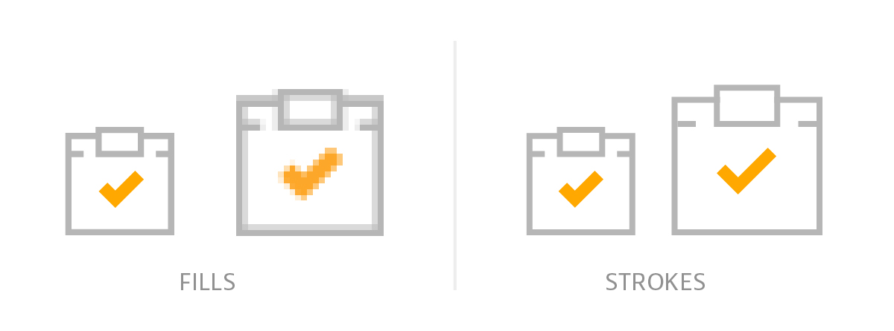
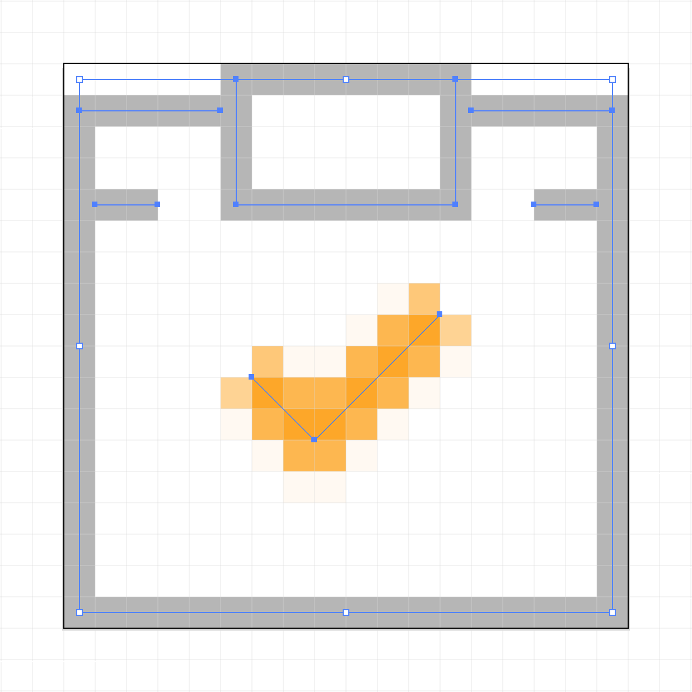

# More Gotchas Getting Inline SVG Into Production—Part II

[](https://www.instagram.com/roblevintennis/)

<em class="explanation">The following is a guest post by Rob Levin and Chris Rumble. Rob and Chris both work on the product design team at <a href="https://medium.com/mavenlink-product-development">Mavenlink</a>. Rob is also creator and host of the [SVG Immersion Podcast](http://svgimmersion.com/) and wrote the original [5 Gotchas](https://css-tricks.com/gotchas-on-getting-svg-into-production/) article back in '14. Chris, is a [UI and Motion Designer/Developer](http://www.rumble-ish.com/) based out of San Francisco. In this article, they go over some additional issues they encountered after incorporating inline SVGs in to Mavenlink's flagship application more then 2 years ago. The article illustrations were done by [Rob](https://www.instagram.com/roblevintennis/) and—in the spirit of our topic—are 100% vector SVGs!</em> 

Wow, it's been over 2 years since we posted the [5 Gotchas Getting SVG Into Production](https://css-tricks.com/gotchas-on-getting-svg-into-production/) article. Well, we've encountered some new gotchas making it time for another follow up post! We'll label these 6-10 paying homage to the first 5 gotchas in the original post :)


## Gotcha Six: IE Drag & Drop SVG Disappears


If you take a look at the animated gif above, you'll notice that I have a dropdown of task icons on the left, I attempt to drag the row outside of the sortable's container element, and then, when I drop the row back, the SVG icons have completely disappeared. This insidious bug didn't seem to happen on Windows 7 IE11 in my tests, but, did happen in Windows 10's IE11!  Although, in our example, the issue is happening due to use of a combination of [jQuery UI Sortable](https://jqueryui.com/sortable/) and the [nestedSortable plugin](https://github.com/ilikenwf/nestedSortable) (which needs to be able to drag items off the container to achieve the nesting, any sort of detaching of DOM elements and/or moving them in the DOM, etc., could result in this disappearing behavior. Oddly, I wasn't able to find a Microsoft ticket at time of writing, but, if you have access to a Windows 10 / IE11 setup, you can see for yourself how this will happen in this [simple pen](https://codepen.io/roblevin/pen/RgZJLd?editors=1010) which was forked from [fergaldoyle](https://github.com/fergaldoyle). The pen shows the same essential disappearing behavior happening, but, this time it's caused by simlpy moving an element containing an SVG icon via JavaScript's `appendChild`.

A solution to this is to [reset the href.baseVal attribute](https://stackoverflow.com/questions/31900472/use-jquery-to-change-xlinkhref-attribute-of-svg-element/37667689#37667689) on all `<use>` elements that descend from `event.target` container element when a callback is called. For example, in the case of using Sortable, we were able to call the following method from inside Sortable's `stop` callback:

```javascript
function ie11SortableShim(uiItem) {
  function shimUse(i, useElement) {
    if (useElement.href && useElement.href.baseVal) {
      // this triggers fixing of href for IE
      useElement.href.baseVal = useElement.href.baseVal;
    }
  }

  if (isIE11()) {
    $(uiItem).find('use').each(shimUse);
  }
};
```

I've left out the `isIE11` implementation, as it can be done a number of ways (sadly, most reliably through sniffing the `window.navigator.userAgent` string and matching a regex). But, the general idea is, find all the `<use>` elements in your container element, and then reassign their `href.baseVal` to trigger to IE to re-fetch those external `xlink:href`'s. Now, you may have an entire row of complex nested sub-views and may need to go with a more brute force approach. In my case, I also needed to do:
```javascript
  $(uiItem).hide().show(0);
```
to rerender the row—your mileage may vary ;)

If you're experiencing this outside of Sortable, you likely just need to hook in to some "after" event on whatever the parent/container element is, and then do the same sort of thing.

As I'm boggled by this IE11 specific issue, I'd love to hear if you've encountered this issue yourself, have any alternate solutions and/or greater understanding of the root IE issues, so do leave a comment if so.

## Gotcha Seven: IE Performance Boosts Replacing SVG4Everybody with Ajax Strategy

[](https://www.instagram.com/roblevintennis/)
TBD but will address following:
- Link to original css tricks article on using ajax instead of svg4everybody: https://css-tricks.com/ajaxing-svg-sprite/
- base section off https://twitter.com/roblevintennis/status/661343623645032448 
- Our work had ~15 sec IE11 page w/lots SVG icons & svg4everybody; used ur ajax er'thang-brought down to ~2 (for uncached first hit!)
- so, it works if you can Ajax SUPER fast so no flash-of-no-svg and/or you're page is already throwing up a spinner while preloading a bunch of SPA views anyhow, otherwise, consider just dumping the inline SVG defs (but loosing the cachability win)

## Gotcha Eight: Non-Scaling Stroke From the Trenches

In cases where you want to have various sizes of the same icon, you may want to lock down the stroke sizes of those icons…

### Why, What's the Issue?


Imagine you have a `height:10px; width:10px;` icon with some `1px` shapes and scale it to `15px`. Those `1px` shapes will now be `1.5px` which ends up creating a soft or fuzzy icon due to borders being displayed on sub-pixel boundaries. This softness also depends on what you scale to, as that will have a bearing on whether your icons are on sub-pixel boundaries. Generally, it's best to control the sharpness of your icons rather than leaving them up to the will of the viewer's browser.
 
The other problem is more of a visual weight issue. As you scale a standard icon using fills, it scales proportionately...I can hear you saying "SVG's are supposed to that". Yes, but being able to control the stroke of your icons can help them feel more related and seen as more of a family. I like to think of it like using a <em>text</em> typeface for titling, rather than a display or <em>titling</em> typeface, you can do it but why when you could have a tight and sharp UI.

### Prepping the Icon
I primarily use Illustrator to create icons, but plenty of tools out there will work fine. First, size and align your icon to the pixel grid (⌘⌥Y in Illustrator for pixel preview, on a Mac) at the size you are going to be using it. I try to keep diagonals on 45° and adjust any curves or odd shapes to keep them from getting weird. No formula exists for this, just get it as close as you can to something you like.

### Exporting AI
I usually just use the Export As "SVG" option in Illustrator, I find it gives me a standard and minimal place to start. I use the Presentation Attributes setting and save it off. It will come out looking something like this:

```xml
<svg id="Layer_1" data-name="Layer 1" xmlns="http://www.w3.org/2000/svg" width="18" height="18" viewBox="0 0 18 18">
  <title>icon-task-stroke</title>
  <polyline points="5.5 1.5 0.5 1.5 0.5 4.5 0.5 17.5 17.5 17.5 17.5 1.5 12.5 1.5" fill="none" stroke="#b6b6b6" stroke-miterlimit="10"/>
  <rect x="5.5" y="0.5" width="7" height="4" fill="none" stroke="#b6b6b6" stroke-miterlimit="10"/>
  <line x1="3" y1="4.5" x2="0.5" y2="4.5" fill="none" stroke="#b6b6b6" stroke-miterlimit="10"/>
  <line x1="17.5" y1="4.5" x2="15" y2="4.5" fill="none" stroke="#b6b6b6" stroke-miterlimit="10"/>
  <polyline points="6 10 8 12 12 8" fill="none" stroke="#ffa800" stroke-miterlimit="10" stroke-width="1"/>
</svg>
```

I know you see a couple of 1/2 pixes in there, this is purposeful! The coordinates are placed on the 1/2 pixel so that your 1px stroke is 1/2 on each side of the path. It looks something like this (in Illustrator):


### Clean Up

[](https://www.instagram.com/roblevintennis/)

Our Grunt task, which Rob talks about in the previous article, cleans up almost everything. Unfortunately for the non-scaling-stroke you have some hand-cleaning to do on the SVG, but I promise it is easy! Just add a class to the paths on which you want to restrict stroke scaling. Then, in your CSS add a class and apply the attribute `vector-effect: non-scaling-stroke;` which should look something like this: 

CSS

```css
.non-scaling-stroke {
  vector-effect: non-scaling-stroke;
}
```

SVG

```xml
<svg xmlns="http://www.w3.org/2000/svg" viewBox="0 0 18 18">
  <title>icon-task-stroke</title>
  <polyline class="non-scaling-stroke" points="5.5 1.5 0.5 1.5 0.5 4.5 0.5 17.5 17.5 17.5 17.5 1.5 12.5 1.5" fill="none" stroke="#b6b6b6" stroke-miterlimit="10"/>
  <rect class="non-scaling-stroke" x="5.5" y="0.5" width="7" height="4" fill="none" stroke="#b6b6b6" stroke-miterlimit="10"/>
  <line class="non-scaling-stroke" x1="3" y1="4.5" x2="0.5" y2="4.5" fill="none" stroke="#b6b6b6" stroke-miterlimit="10"/>
  <line class="non-scaling-stroke" x1="17.5" y1="4.5" x2="15" y2="4.5" fill="none" stroke="#b6b6b6" stroke-miterlimit="10"/>
  <polyline class="non-scaling-stroke" stroke="currentcolor" points="6 10 8 12 12 8" fill="none" stroke="#ffa800" stroke-miterlimit="10" stroke-width="1"/>
</svg>
```

This keeps the strokes, if specified, from changing (otherwise it stays at 1px) when the SVG is scaled. That's it! Now, you have beautiful pixel adherent strokes that will maintain stroke width!

And after all is said and done (and you have preprocessed via grunt-svgstore per the first article), your svg will look like this in the defs file:

```xml
<svg>
  <symbol viewBox="0 0 18 18" id="icon-task-stroke">
    <title>icon-task-stroke</title>
    <path class="non-scaling-stroke" stroke-miterlimit="10" d="M5.5 1.5h-5v16h17v-16h-5"/>
    <path class="non-scaling-stroke" stroke-miterlimit="10" d="M5.5.5h7v4h-7zM3 4.5H.5M17.5 4.5H15"/>
    <path class="non-scaling-stroke" stroke="currentColor" stroke-miterlimit="10" d="M6 10l2 2 4-4"/>
  </symbol>
</svg>
```

### CodePen Example

The icon set on the left is scaling proportionately and on the right we are using the `vector-effect: non-scaling-stroke;`. In the end this might be more of a visual preference then a gottcha but, anytime you have some more control over how your icons look and behave, I feel like it's a win.
<p data-height="265" data-theme-id="light" data-slug-hash="QgMBRB" data-default-tab="result" data-user="Rumbleish" data-embed-version="2" data-pen-title="SVG Icons: Non-Scaling Stroke " class="codepen">See the Pen <a href="https://codepen.io/Rumbleish/pen/QgMBRB/">SVG Icons: Non-Scaling Stroke </a> by Chris Rumble (<a href="https://codepen.io/Rumbleish">@Rumbleish</a>) on <a href="https://codepen.io">CodePen</a>.</p>
<script async src="https://production-assets.codepen.io/assets/embed/ei.js"></script>


## Gotcha Nine: TBD

## Gotcha Ten: TBD

## Conclusion

TBD
