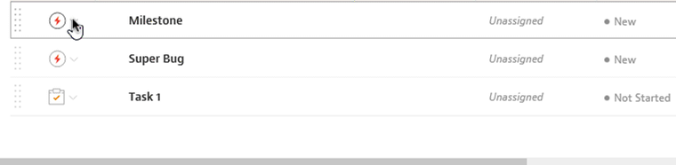
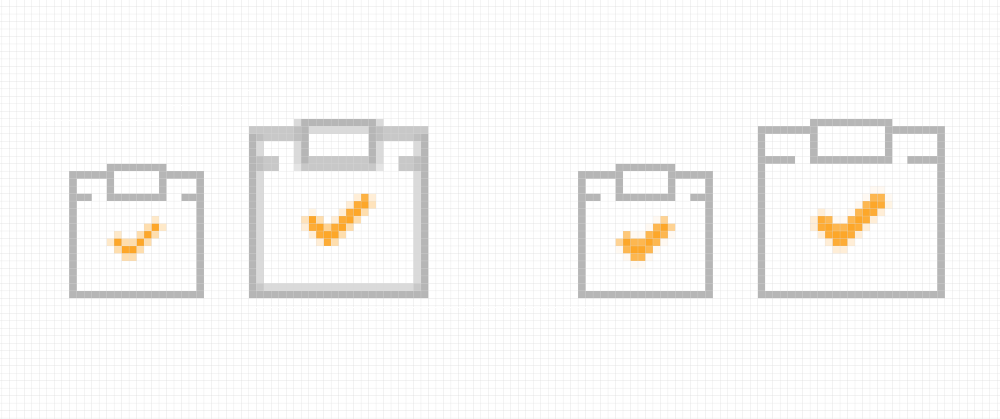

<em class="explanation">The following is a guest post by Rob Levin and Chris Rumble. Rob and Chris both work on the product design team at <a href="https://medium.com/mavenlink-product-development">Mavenlink</a>. Rob is also creator and host of the [SVG Immersion Podcast](http://svgimmersion.com/) and wrote the original 5 Gotchas article in '14. Chris [ADD INTRO AND LINK HERE]. In this article, they go over some additional issues they encountered incorporating inline SVGs in to the production application over 2 years in.</em> 

Wow, it's been over 2 years since we posted the [5 Gotchas Getting SVG Into Production](https://css-tricks.com/gotchas-on-getting-svg-into-production/) article. Well, we've encountered some new gotchas making it time for another follow up post! We'll label these 6-10 paying homage to the first 5 gotchas in the original post :)

## Gotcha Six: IE Drag & Drop SVG Disappears



If you take a look at the animated gif above, you'll notice that I have a dropdown of task icons on the left, I attempt to drag the row outside of the sortable's container element, and then, when I drop the row back, the SVG icons have completely disappeared. This insidious bug didn't seem to happen on Windows 7 IE11 in my tests, but, did happen in Windows 10's IE11!  Although, in our example, the issue is happening due to use of a combination of [jQuery UI Sortable](https://jqueryui.com/sortable/) and the [nestedSortable plugin](https://github.com/ilikenwf/nestedSortable) (which needs to be able to drag items off the container to achieve the nesting, any sort of detaching of DOM elements and/or moving them in the DOM, etc., could result in this disappearing behavior. I wasn't able to find a Microsoft ticket at time of writing, but, if you have a setup available, you can see for yourself how this will happen in this simple [example](https://codepen.io/roblevin/pen/RgZJLd?editors=1010) which was forked from [fergaldoyle](https://github.com/fergaldoyle). The pen shows the same essential issue happening, but, this time when simlpy moving an element containing an SVG icon via JavaScript's `appendChild`.

A solution to this is to [reset the attribute](https://stackoverflow.com/questions/31900472/use-jquery-to-change-xlinkhref-attribute-of-svg-element/37667689#37667689) of any of the `<use>` elements upon said event completing. In my specific case of using Sortable, I was able to call the following method from inside Sortable's  `stop` callback:

```javascript
function ie11SortableShim(uiItem) {
  function shimUse(i, useElement) {
    if (useElement.href && useElement.href.baseVal) {
      // this triggers fixing of href for IE
      useElement.href.baseVal = useElement.href.baseVal;
    }
  }

  if (isIE11()) {
    $(uiItem).find('use').each(shimUse);
  }
};
```

I've left out the `isIE11` implementation, as it can be done a number of ways. But, the general idea is, find all the `<use>` elements in your container element, and then reassign their `href.baseVal` to trigger to IE to re-fetch those external `xlink:href`'s. Now, you may have an entire row of complex nested sub-views and may need to go with a more brute force approach. In my case, I also needed to do:
```javascript
  $(uiItem).hide().show(0);
```
to rerender the row—your mileage may vary ;)

If you're experiencing this outside of Sortable, you likely just need to hook in to some "after" event on whatever the parent/container element is, and then do the same sort of thing.

As I'm boggled by this IE11 specific issue, I'd love to hear if you've encountered this issue yourself, have any alternate solutions and/or greater understanding of the root IE issues, so do leave a comment if so.

## Gotcha Seven: IE Performance Boosts Replacing SVG4Everybody with Ajax Strategy

* Link to original css tricks article on using ajax instead of svg4everybody: https://css-tricks.com/ajaxing-svg-sprite/

* base section off https://twitter.com/roblevintennis/status/661343623645032448 
- work had ~15 sec IE11 page w/lots SVG icons & svg4everybody; used ur ajax er'thang-brought down to ~2 (for uncached first hit!)
- so, it works if you can Ajax SUPER fast so no flash-of-no-svg and/or you're page is already throwing up a spinner while preloading a bunch of SPA views anyhow, otherwise, consider just dumping the inline SVG defs (but loosing the cachability win)

## Gotcha Eight: NonScaling Stroke From the Trenches

In cases where you want to have various sizes of the same icon you may want to lock down the stroke sizes of those icons...

### Why what's the issue?



Imagine you have a `height:10px; width:10px;` icon with some `1px` shapes and scale it to `15px`. Those `1px` shapes will now be `1.5px` which is gross and the fuzz is more visible on standard density screens.  It also depends on what you scale to, as that will have a bearing on whether or not your icons are on the sub pixel or not. Generally I prefer not to leave the sharpness of my icons to the will of the viewer's browser.
 
The other problem is more of a visual weight issue. As you scale a standard icon using fills it scales proportionately...I can hear you asking "but aren't that what svg's are supposed to do?". Yes but, being able to control the stroke of your icons can help them feel more related and seen as more of a family. I like to think of it like using a text typeface for titling, rather than a display or titling typeface, you can do it but it's not gonna look so hot.

### Exporting AI
I usually just use the Export As "svg" option in Illustrator, I find it gives me a standard and minimal place to start. I use the Presentation Attributes setting and save it off (Most of the time it takes me a few try's to remember that, as I don't do it too often).

### Clean up
Unfortunately you do have some hand cleaning to do on the svg, I haven't found anything on automating it yet although I'm sure it's out there. I start by clearing out the `data-name` and `id` then add in the `x="0px" y="0px"`, `enable-background="new 0 0 height width"` and ` xml:space="preserve"`. Next I'll add in `class="non-scaling-stroke"` which applies

```css
.non-scaling-stroke {
	vector-effect: non-scaling-stroke;
}
```

to the strokes that I'd like to lock down when scaling the icon. That's it! Now you have beautiful pixel adherent strokes!

### CodePen Example

The set on the left are scaling proportionately and on the right we are maintaining the same stroke width while scaling. In the end it may be more of a preference then a gottcha but anytime you have some more control over what's happening, I feel like it's a win.
<p data-height="275" data-theme-id="light" data-slug-hash="QgMBRB" data-default-tab="result" data-user="Rumbleish" data-embed-version="2" data-pen-title="SVG Icons: Non-Scaling Stroke " class="codepen">See the Pen <a href="https://codepen.io/Rumbleish/pen/QgMBRB/">SVG Icons: Non-Scaling Stroke </a> by Chris Rumble (<a href="https://codepen.io/Rumbleish">@Rumbleish</a>) on <a href="https://codepen.io">CodePen</a>.</p>
<script async src="https://production-assets.codepen.io/assets/embed/ei.js"></script>

## Gotcha Nine: Maybe something on themeing?
(Need to build out more but here's the idea...Also I need to double check cause I may have been theming more than just icons) 

Probably not a gottcha...but still kinda fun. Since you are already using grunt to build your defs file why not add some easy svg theming? 

To get started add this to your grunt task:

```javascript
var globalConfig = {
	file: 'themes/your-theme' // this is the default value, for a single project.
}
```
and 

```javascript
grunt.registerTask('theme', 'Upload code to specified target.', function(themeName) {
    globalConfig.file = 'themes/' + themeName;
    grunt.task.run( 'clean:dist','copy:main','svgstore:default', 'svgmin:dist');
});
```
then just run `grunt theme:your-theme-name`

And wholla, populate a whole new icon set without loosing the old one.


## Gotcha Ten: TBD

## Conclusion
TBD
